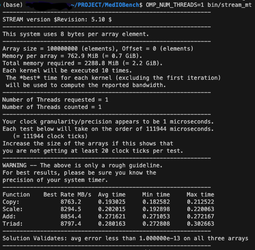

# Experimental Results

## 1. Experimental Setup

### Dataset

Uncompressed multi-page TIFF volumetric medical image:

- Size: 3.77 GB
- Slices: 704
- Resolution: 1624 x 1768
- Pixel type: uint16
- Endianness: big-endian
- Per-slice size: ~5.74 MB

---

### Hardware

- CPU: Intel Xeon Gold 6230R @ 2.10GHz  
  - Microarchitecture: Cascade Lake  
  - Physical cores: 26 per socket  
  - System configuration: Dual-socket (52 cores, 104 threads total)  
- RAM: 128 GB DDR4 @ 2933 MT/s  
- Storage: Samsung NVMe 3.5TB  
- PCIe: 4.0 x16 (~32 GB/s theoretical)

Measured ceilings:

- DISK_CEILING_GBPS = 1.50 GB/s
- MEMORY_CEILING_GBPS = 8.80 GB/s (single-thread STREAM Triad)

---

### Measurement Protocol

- 5 runs per condition
- Mean time reported
- Throughput = file_size / elapsed_time
- Correctness verified via checksum equivalence
- Benchmarks executed on a shared server (background variability possible)

---

## 1.1 STREAM Baseline Measurement

Single-thread STREAM Triad was measured immediately prior to benchmark runs to define MEMORY_CEILING_GBPS.

Memory ceiling used in this report:

    MEMORY_CEILING_GBPS = 8.80 GB/s

  

*Figure: Single-thread STREAM Triad result defining MEMORY_CEILING_GBPS.*

---

## 2. Cold Cache Results (Disk Bound)

Disk ceiling = DISK_CEILING_GBPS = 1.50 GB/s

### Cold Cache Normalization

    x Disk = Measured Throughput (GB/s) / DISK_CEILING_GBPS

### Python

| API  | Pattern | Mean Time (s) | GB/s | x Disk |
|------|---------|---------------|------|--------|
| read | whole   | 5.989         | 0.629| 0.42x  |
| mmap | whole   | 3.167         | 1.189| 0.79x  |
| read | slice   | 3.807         | 0.989| 0.66x  |
| mmap | slice   | 3.631         | 1.037| 0.69x  |

### C

| API  | Pattern | Mean Time (s) | GB/s | x Disk |
|------|---------|---------------|------|--------|
| read | whole   | 2.689         | 1.400| 0.93x  |
| mmap | whole   | 2.453         | 1.535| 1.02x  |
| read | slice   | 2.252         | 1.672| 1.11x  |
| mmap | slice   | 2.041         | 1.844| 1.23x  |

---

## 3. Warm Cache Results (Memory Bound)

Memory ceiling = MEMORY_CEILING_GBPS = 8.80 GB/s (single-thread STREAM Triad)

### Warm Cache Normalization

    x STREAM = Measured Throughput (GB/s) / MEMORY_CEILING_GBPS

This normalization compares loader throughput against a standard single-thread memory streaming workload.

Important:

- This is NOT theoretical DRAM peak.
- This is NOT multi-thread system bandwidth.
- Values greater than 1.0x are possible because STREAM Triad performs both reads and writes, while the mmap loader performs primarily read only streaming.

### Python

| API  | Pattern | Mean Time (s) | GB/s | x STREAM |
|------|---------|---------------|------|----------|
| read | whole   | 4.454         | 0.845| 0.10x    |
| mmap | whole   | 1.575         | 2.390| 0.27x    |
| read | slice   | 1.935         | 1.946| 0.22x    |
| mmap | slice   | 1.335         | 2.820| 0.32x    |

### C

| API  | Pattern | Mean Time (s) | GB/s | x STREAM |
|------|---------|---------------|------|----------|
| read | whole   | 0.794         | 4.740| 0.54x    |
| mmap | whole   | 0.216         |17.450| 1.98x    |
| read | slice   | 0.789         | 4.769| 0.54x    |
| mmap | slice   | 0.213         |17.672| 2.01x    |

---

## 4. Key Findings

- Cold path is disk bound.
- Warm path is memory bound.
- mmap significantly improves warm cache performance in C.
- Python overhead prevents memory saturation.
- Significant parallel scaling headroom exists.

---

## 5. Limitations and Future Work

- Single file tested: multi-file validation needed across varying sizes and slice counts.
- Parallel loader experiments: multi-thread scaling from 1 to 52 threads not yet measured.
- Shared server environment: dedicated hardware runs needed to eliminate background variability.
- Latency distribution: percentiles (p50, p95, p99) not yet reported, only means.
- Page-fault and perf counter validation: mechanistic confirmation of cold/warm cache behavior via hardware counters.
- Storage type comparison: HDD, NVMe, and network attached storage not yet benchmarked.
